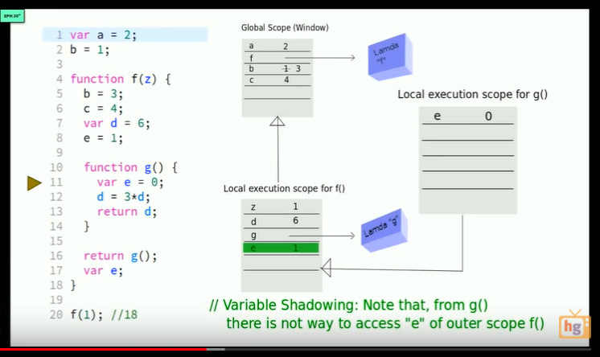
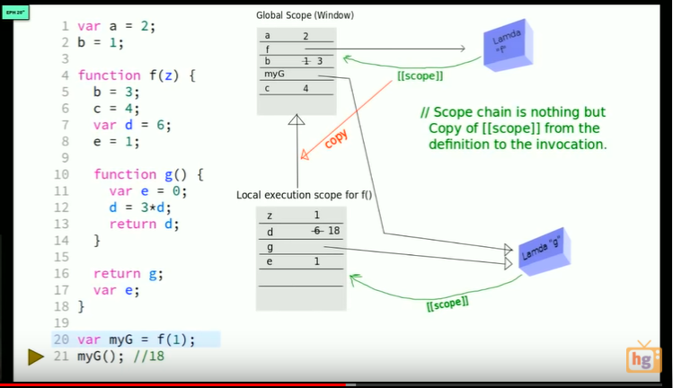

**Perfection is reached not when there is nothing more to add, but when there is nothing more to subtract -Antoine de Saint-Exupéry**

When we run a javascript file, the runtime environment (this can be a browser like chrome with v8 engine or node.js runtime) creates 2 things, first the global object (if we are using browser this object is **window** and **this** which shows the global object)

If we use browser, this global context (Window object) and this reference is always created with new page, even if we don't have any javascript file. Like if we got some very basic html file, if we go the console we'll see that we got window object and this reference.

Even if we got more than one js file in one html file, we got only one window object.

 ## The Execution Context - Creation and Hoisting
* Related video: https://www.youtube.com/watch?v=QyUFheng6J0

* Javascript is a both compiled and interpreted language. javascript vm first scans the current execution scope for objects, variables and funcions then executes line by line.



* what happens here is, first vm starts as line 1, and creates a variable in global scope, which is window if we are using a browser, then skips **b** because js doesn't know what b is, we didn't declare b. then comes to line 4 and creates a function pointer and puts all the function inside to let's say lambda "f" like a string blob.

* then js directly jumps to line 20, because other lines are in different scope not belong to main scope. We can call this process creation or compile proess, and directly vm changes to execution step and execute line 1 and puts 2 for variable **a**, then comes to line 2, and looks it'S global scope and sees there is no b, so creates a variable named b, and then executes line 20. 

* but for executing line 20 we need compile and execute function, so for this a new heap is opened in javascript and it starts from line 4, puts z to the local execution scope's heap but not write 1 near to it now, then skip line 5 and 6 because we don't decleare b and c, puts d in local scope skips e (line 8), sees another function and creates a function pointer and this pointer shows lambda g, which is another string blob. and comes to line 17 and creates variable e.

* here hoisting begins actually, because in line 8 we say `e = 1` but in line 17 we said ``var e` so this is hoisting, because of the first search and look for variables then execute mechanism of javascript this hoisting is possible.

* vm starts to execute function f from line 4, comes line 5 and looks it's local execution scope for function f() but there is no b so, it asks to one above scope which is global one, and sees b here and sets new value to b.

* comes line 6, can't sees variable c in local scope so ask one above scope and if there is no c here, because function f()'s one higher scope is global scope, c is created in this global scope

* in line 7, gives variable **d** to it's value, in line 8 gives variable **e** its value and comes to line 16. and creates new local execution scope for function g(), and do the same things for g.

* Important things are each local scope has a pointer to it's one above scope, so local execution scope of f() can reach to global scope, and local execution scope for g() can reach scope of f().

* **variable shadowing** is we look variable e's there are 2 of them one is in f() scope other is in g()'s scope, and they are different variables, because we create and decleare e both f() and g() scope.

* after vm execute function g() and function f() then gc comes to play and removes these execution scope's and objects, variables in heap.



* above image, we return a function to **var myG**, so actually we are creating a closure. When line 10 executed, in local scope of f() a new pointer is created for function g() and when line 16 executed vm creates new execution scope for g().

* And when line 20 is executed variable **myG** in global scope starts to show lambda of g. so when function g() fully executed and finish it job, heap of g() is deleted by gc, but lambda g will stay, and because we can reach lambda g with function f(), also function f()'s heap stays, by this way we can keep the variables of f(), so it called closure.

* Another important point is all these lambda's have a back pointer to the scope where it is pointing. this back pointer is hidden from us, and we cannot use this via API, but javascript engine uses it. 

### javascript and undefined
undefined is a special type in javascript, and if we declare a variable, it's very initial value is undefined. 

Important point is, undefined and **not defined** are different things in javascript. If I write just `console.log(a)`, I'll get an error says a is not defined  
but if i write like
```javascript
var a
console.log(a)
```

then I get value of a, undefined. Also I can check if variable if undefined or not by `a === undefined`

## Scope Chain
Before talking about scope chain, we need to understand two other concepts. First is **execution context** which means, abstract concept of environment where the javascript code lives. Each javascript functions have it's own execution context, means these function lives with their variables, references etc.  
**Lexical Environment** defines where a function phsycially sits. Also we can think this which function creates which one. As en exmaple:  
```javascript
function a() {
    // ...
}

function b() {
    // ...
    function c() {
        // ...
    }
}
```
below code, **function a** and **function b** their lexical environment are in global scope. If we look func a and b we can see that, they are created in global context.  
But for **function c** it's lexical environment is in function b, because function b creates function c.

**Scope chain** is a logical chain, for example scope chain for function c, first goes to function b, and then global scope. for function a, it directly goes to global scope.

```javascript
function b() {
  console.log("inside function b")
  console.log(myVar)
}

function a() {
  var myVar = 2

  function c() {
    console.log("inside function c")
    console.log(myVar)
  }
  c()
  b()
}

var myVar = 1
a()
```

we can understand scope chain from this example, as we can see there are 2 different **myVar** variables in the code. and for function b, `console.log` output will be 1 because, function b's scope chain is directly global scope and js runtime will look the myVar in function b, and when it couldn't see it will look the next environment in the chain which is global scope and myVar in global scope is 1.  
Here function a is calling function b, but for myVar value this isn't important, we need to consider scope chain.  

For function c, myVar will be 2, because runtime will look the function c first and couldn't find myVar, then will look the next environemnt in scope chain which is function a (also we can see that function a creates function c, but global scope creates function b) for that reason myVar value in function c will be 2.


## Scope, ES6 and let keyword

Difference between var and let are:  
* let keyword doesn't allow hoisting, but var allows
    ```javascript
    console.log(a) //undefined
    var a = 'hello'
    console.log(a) //hello
    ```
    but if we use let
    ```javascript
    console.log(b) //gives error "ReferenceError b is not defined"
    let b = 'hello'
    console.log(b)
    ```

* another difference is, let is block scoped and var is function scoped. Means that if we use let inside a for/if or any other block, outside of the block we can't use that variable again, but if we use var, variable lives inside the function.
    ```javascript
            function colour() { 
  
            setInterval(function() { 
  
                if (document.getElementById('var').style.color == 'black') 
                    var col1 = 'blue'; 
                else 
                    col1 = 'black'; 
  
                // setting value of color 1 through var 
  
                if (document.getElementById('let').style.color == 'black') { 
                    let col2 = 'red'; 
                } else { 
                    col2 = 'black'; 
                } 
  
                // setting value of color 2 through let 
  
                document.getElementById('var').style.color = col1; 
  
                document.getElementById('let').style.color = col2; 
  
                // changing color of h1 in html 
            }, 500); 
  
        } 
    ```
    it gives Uncaought ReferenceError, because of **col2** because col2 is defined in if block and we tried to use it outside f the block.

## JS Primite types and Operators
Javascript have 6 different primite types, there are:  
* undefined -> we shouldn't use it, only compile gives this variable
* null -> it has the same function with undefined, also null defines 'lack of exsistence' but we can use and give this value to variables.
* bool
* number -> this is the only numerical value in javascript, actually number type is floating number
* string
* symbol -> this came with ES6

Operators are actually functions but with a different writing style. For example `3 + 5` is a actually function, we couldn't use like that but we think `+(3,5)`. So we are using `+` operator with a **infix notation**, means putting the function between two variables.

## Precedence and Associativity
* all operators have associativity, left to right or, right to left. For example '=' operator is right to left operator. For example if we write:  
```javascript
a=2, b=3. c=4
a=b=c  // all a b c becomes 4
```
reason is first it will work like a=(b=c), and first compiler look into parantesis, and equals b to c, then it will liek a = 4 and a become 4. Also it will return value which is on the right (it is for right associativity)

## Coercion
Coersion is converting a value from one to another. for example if we write `var b = 'hello' + 2`, it will **hello2**, because compiler automaticly convert numeric 2, to string. 

## Comparision Operators
1 < 2 < 3 returns true, also  
3 < 2 < 1 returns true, reason is '<' operator is left to right operator, so it will work like (3<2)<1 and result of 3 < 2 is false, and false < 1 is true  
Here js compiler uses **coersion**, so it will look the false value and run Number(false) method automaticly, this method tries to convert input to numeric type, and Number(false) return 0, so 0 < 1 return true.  

Another important point is, equality operator. it is left to right operator. and has 2 different type. First is equality, which is '==' and if use `'3' == 3` it returns true, but we compared string to numeric, it should be false. Reason is again **Coersion**. Number('3') will return to numeric 3, so 3 == 3 will return true.

Also there is another equality operator, named **Strict Equality**. ===, when we use that compiler doesn't run Coersin functions so `'3' === 3` becames false. While we are coding javascript we should use strict equality operator.

## Existence and Boolean
```javascript
Boolean(undefined) // returns false
Boolean(null) // returns false
Boolean("") // returns false
Boolean(0) // returns false
```

for example if we have a code like that
```javascript
var a
// code does something and tries to put value for a
if (a) {
    // ...
}
```
the code above, if a is undefined, null or empty string, if statement will be false, otherwise it will true.  
But also if a is equal to 0, then also if statement will be false, beacuse Coersion of Boolean(0) = false.  
And if we want to check if a is equal to zero or nothing, then our if statement should be like `ìf(a || a === 0)`. === operator's presedence is higher then || operator, so first a === 0 compiled, and the result returns true, (if we set a = 0), then it will run a, which returns false. `if(false | true)` returns true.

## Default Values
```javascript
function greet(name) {
  console.log(name)
}

greet() // return 'undefined'

function greet2(name) {
  name || '<your name is here>'
  console.log(name)
}

greet2() // return <your name is here>
greet2('joe') // returns joe
greet2(0) // return <your name is here>
```

above code snippet, first function call returns 'undefined' because we pass nothing to name, (which is actually undefined type) and console.log uses coersion and return undefined type to string undefined.  

Second function, greet2() returns \<your name is here>. Reason is, `name || 'some string'` name will be false, and some string is true, so false || true returns true. But || operator has special functionality, when we give name || 'someting' it will return true one, in this situation this is \<your name is here> string (because name is false).  
But `'abc' || 'xyc'` retunr abc because, both sides are true, and || operator returns the left one. 
But also we need to careful about 0, because Boolean(0) is false, and greet2(0) return the string even so name is not null and equal to 0.

## Defauls values in ES6
before ES6, if we want to give default value, we should use typeof function like
```javascript
function greet(name) {
  name = name || 'Joe' // joe is default value here
  console.log(name)
}

function greet2(name) {
  name = (typeof(name) !== "undefined") ? name : 'Joe'
  // the reason of comparision with string undefined is
  // typeof function return undefined values as string 'undefined'
  console.log(name)
}

greet() // returns joe 
greet2() // returns joe
```
but with ES6 we can directly give default values like
```javascript
function greet(name='Joe') {
  console.log(name)
}

greet()
```

Another important point is, in ES6 default values can also be functions, for example:
```javascript
function greet(name='Joe') {
  return name
}

function greetToMeet(func=greet) {
  aName = func()
  console.log(aName)
}

greetToMeet()
```


    