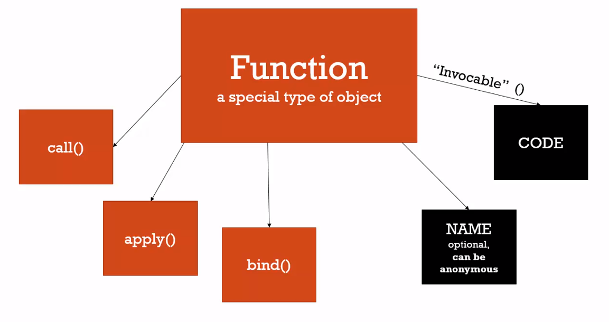

# Objects, Functions and 'this'

we know that if we use innner function inside the object method, this inner function this will show global variable. But if we want to keep object's reference we can use like this
```javascript
var c = {
  name: 'The c object',
  log: function() {
    self = this
    console.log(self)

    var setname = function(newname) {
      self.name = newname
    }
    setname('updated again! The c object')
    console.log(self)
    
  }
}

c.log()
```
by this way, self will hold the reference of the object.

# Arrays - Collections of Anything

var arr = new Array() and  
var arr = []  
are same thing.

In javascript we can put anything in a array, for example in java if we create an array and put integer, other types should be integer too, but in javascript we don't have this restriction

```javascript
var arr = [
  1,
  false,
  {
      name: "Tony",
      address: "Something street"
  },
  function(name) {
      var greeting = 'Hello';
      console.log(greeting + " " + name);
  },
  "hello"
]
```
even we can execute function from array like
`arr[3]("senko")`

# arguments and Spread
```javascript
function greet(firstname, lastname, language) {
    console.log(firstname)
    console.log(lastname)
    console.log(language)
}
greet()
```

above code, when we execute greet function, actually js creates firstname lastname and language variables and gives them undefined value. so this code will work and argument values will be undefined

we mentioned that when js creates new execution environment, it creates 4 things, variable env, this, reference to the outher execution env and arguments. so when we call greet, these arguments will be create in arguments part of the execution env and js will give undefined value to them.

in js we got arguments speacial variable that shows us all variables as an array that passed to the function

```javascript
function greet(firstname, lastname, language) {
    console.log(firstname)
    console.log(lastname)
    console.log(language)

    console.log(arguments)
}
greet("john", "doe", "en")
```

# function overloading
function overloading is not working in js, because in js functions are actually objects. 

# Automatic semicolon insertion
```javascript
function getPerson() {
    return 
    {
        firstname: 'Tony'
    }
}

console.log(getPerson());
```

will return undefined. because of automatic semicolon insertion. js looks return keyword and automaticly insert semicolon so return nothing. to fix this we need to do like that
```javascript
function getPerson() {
    return {
        firstname: 'Tony'
    }
}

console.log(getPerson());
```
because js looks return and if return keyword followed by enter then js automaticly insert semicolon, but above code after return we type { so syntax parser wouldn't add semicolon automaticly.

# Immediately invoked function expressions (IIFE)
```javascript
// this won't work because it isn't a statement
function(name) {
  return name;
}

// but this is statement
var a = function(name) {
  return name
}

// this is also statement, because ( ) inside them are statement
(function(name) {
  return name
})

// also it is possible to turn it to IIFE
(function(name) {
  console.log(name)
}("senko")
)

// this is okey because it is a statement
function das (name) {
  return name;
}

// this is IIFE
function das2 (name) {
  return Name;
}("senko")
```


# IIFE and safe code


# Closures

```javascript
function greet(whattosay) {

  return function(name) {
    console.log(whattosay + ' ' + name)
  }
}

var sayHi = greet('Hiiii')
console.log(sayHi)

sayHi('alice')
```
above code is very simple example of closure. Normally when we use like this  
`var sayHi = greet("Hiiii")`  
we think that when we call greet a new execution context opens, js engine executes the code and then this execution context removed because it's job finished. But if happens like this then inner function never knows the value of `whattosay`. Remember that every execution context has a reference to the it's outer context. So in this example greet function has a pointer to the global context and the inner function has a reference to the greet function. And js engine knows that so it doesn't delete the execution environment of greet function. (It keeps the variables inside that) so when we call inner function, this function can still reach the it's outer scope's (greet function) variables.

```javascript
function buildFunctions() {

  var arr = [];

  for(var i=0; i<3; i++) {
    arr.push(
      function() {
        console.log(i)
      }
    )
  }

  return arr;
}

var funcs = buildFunctions()
funcs[0]();
funcs[1]();
funcs[2]();
```

here normally most of the people expect that funcs going to print 1 2 3 but actually all of them prints 3 on the console. Reason is when buildFunction execution complete, i value is 3. So when funcs[0] or funcs[1] returns to the buildFunction varialbes and look i, they all see value of 3 and print it.

To overcome this we have two different ways, first is using let keyword. One of the difference between let and var is, let binds to the scope. So if you use let keyword between curly parantheses, you can't reach that variable outside of the paranthesis.

```javascript
function buildFunctions() {

  var arr = [];

  for(var i=0; i<3; i++) {
    
    // for every for loop there will be different
    // j variable on different address
    let j = i;

    arr.push(
      function() {
        console.log(j)
      }
    )
  }

  return arr;
}

var funcs = buildFunctions()
funcs[0]();
funcs[1]();
funcs[2]();
```
for example here, everythime complier sees let j, it will create a new j variable and this j will bind to the scope of the for loop. 

another way is using IIEF. If we create a another function and execute it directly we got a new execution context, so if we have 3 different execution context for three of these function we can have 0,1 and 2 values.

```javascript
function buildFunctions() {

  var arr = [];

  for(var i=0; i<3; i++) {
    
    arr.push(
      (function(index) {
        return function(){
          console.log(index)
        }
      }(i)
      )
    )
  }

  return arr;
}

var funcs = buildFunctions()
funcs[0]();
funcs[1]();
funcs[2]();
```

# call() apply() and bind()


all functions have these three methods.

